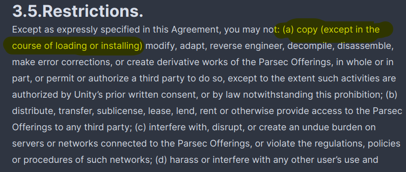

# Parsec

This app is a bit of a shit-show. See the following links:

- https://github.com/clefru/nur-packages/issues/2#issuecomment-742100611
- https://github.com/NixOS/nixpkgs/pull/165954
- https://github.com/NixOS/nixpkgs/issues/95160

## Fixes

Parsec uses a janky self updating mechanism. To fix this I adapted [iagocq's nix code](https://github.com/nix-community/nur-combined/blob/master/repos/iagocq/pkgs/parsec/default.nix#L166) to use a pinned version of the package. While I am not a lawyer, the parsec TOS seems to allow this as nix is a glorified install script:

